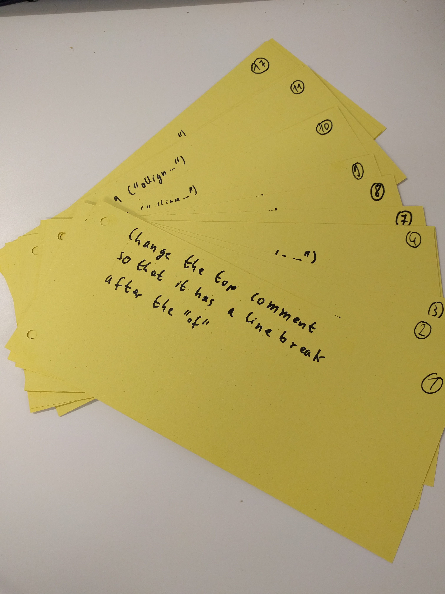

# Version Control Minigame
A social game to teach version control.

This game is intended to be used to teach non developers the usage and purpose of version control. As synchronizing work between multiple people/teams is a global problem this is important knowledge in any line of knowledge work.

## Setup

To run this game take the material from the [material](#material) section.

* Prepare the [source text](#source-text) as a larger poster or on a whiteboard.
* Prepare one copy fo the source text for every participant.
* Prepare every task from the [task list](#Tasks) as a separate card.



## Running the game

To do the game get the group together and tell them that the goal is to experience work as a software engineer.
They should imagine that the [source text](#source-text) is a piece of software. Specifically this means that syntax and
semantics matter (as in the text makes sense). The goal for the group is to get all tasks done in the allotted
time frame.

In the first iteration let the group work on their own. Just give them the cards, start the clock (~5 minutes)
and watch. The assumption is that after one or two minutes the source text transforms into utter chaos as
the conflicting tasks introduce confusion.

As soon as there is enough confusion and you can see that the group will not be able to finish the task stop them.
Get them to recap on the problems they had with a special focus on coordination.

Next explain how branches (everyone has their own copy) and mergin (only one merge at a time) work.
After this hand out the "branch cards" and let the group start again. The assumption is that the conflicts
will be more visible and structured and there should be questions about what to do first/next. At this point
you can explain the role of the functional lead/product owner as the organizing factor in this situation.

If everything works out and the merges are done in the right order you should receive the [target text](#target-text) as a result.

## Material

### Source text

````
1   """
2   This is a program designed to teach the basics of  Version Control and Source Code management.
3   """
4
5   The problem of working with
6   multiple people on the same
7   Source Code base is that during
8   development you have to carefully
9   allign all the changes.
10
11  Otherwise you end up with a huge mess
12  and noone can read your code anymore
13  and also it is not doing what it is supposed to do...
````

### Tasks

````
1 change the top comment so that it has a line break after the of

2 change line 5 ("the problem of working with") to "The principle of programming"

3 change line 5 ("the problem of working with") to "To not go through the hazzle"

4 change line 6 ("multiple...") to "clearly shows that"

5 change line 6 ("multiple...") to "Of having real code"

6 change line 7 ("Source code base...") to "it is really hard"

7 change line 7 ("Source code base...") to "We use this little text"

8 change line 8 ("development you...") to "correctly order all changes made"

9 change line 8 ("development you...") to "As Source Code Substitute"

10 change line 9 ("allign...") to "So that the end result"

11 change line 9 ("allign...") to an empty line

12 change line 10 (empty line) to an empty line

13 change line 10 (empty line) to "When working simultaniously"

14 change line 11 ("Otherwise...") to "the RNA string gives you"

15 change line 11 ("Otherwise...") to "make sure that you align"

16 change line 12 ("and no one...") to "the tax index of Gibralta"

17 change line 12 ("and no one...") to "Or else you end up furiously"

18 change line 13 ("and also...") to "and no other correlation whatsoever"

19 change line 13 ("and also...") to "With a very strange rhyme..."
````

### Target text

````
1   """
2   This is a program designed to teach the basics of
3   Version Control and Source Code management.
4   """
5
6   To not go through the hazzle
7   Of having real code
8   We use this little text
9   As Source Code Substitute
10
11  When working simoultaniously
12  make sure that you align
13  Or else you end up furiously
14  With a very strange rhyme...
````

# License

The MIT License (MIT)

Copyright (c) 2016 Jonas

Permission is hereby granted, free of charge, to any person obtaining a copy
of this software and associated documentation files (the "Software"), to deal
in the Software without restriction, including without limitation the rights
to use, copy, modify, merge, publish, distribute, sublicense, and/or sell
copies of the Software, and to permit persons to whom the Software is
furnished to do so, subject to the following conditions:

The above copyright notice and this permission notice shall be included in all
copies or substantial portions of the Software.

THE SOFTWARE IS PROVIDED "AS IS", WITHOUT WARRANTY OF ANY KIND, EXPRESS OR
IMPLIED, INCLUDING BUT NOT LIMITED TO THE WARRANTIES OF MERCHANTABILITY,
FITNESS FOR A PARTICULAR PURPOSE AND NONINFRINGEMENT. IN NO EVENT SHALL THE
AUTHORS OR COPYRIGHT HOLDERS BE LIABLE FOR ANY CLAIM, DAMAGES OR OTHER
LIABILITY, WHETHER IN AN ACTION OF CONTRACT, TORT OR OTHERWISE, ARISING FROM,
OUT OF OR IN CONNECTION WITH THE SOFTWARE OR THE USE OR OTHER DEALINGS IN THE
SOFTWARE.
